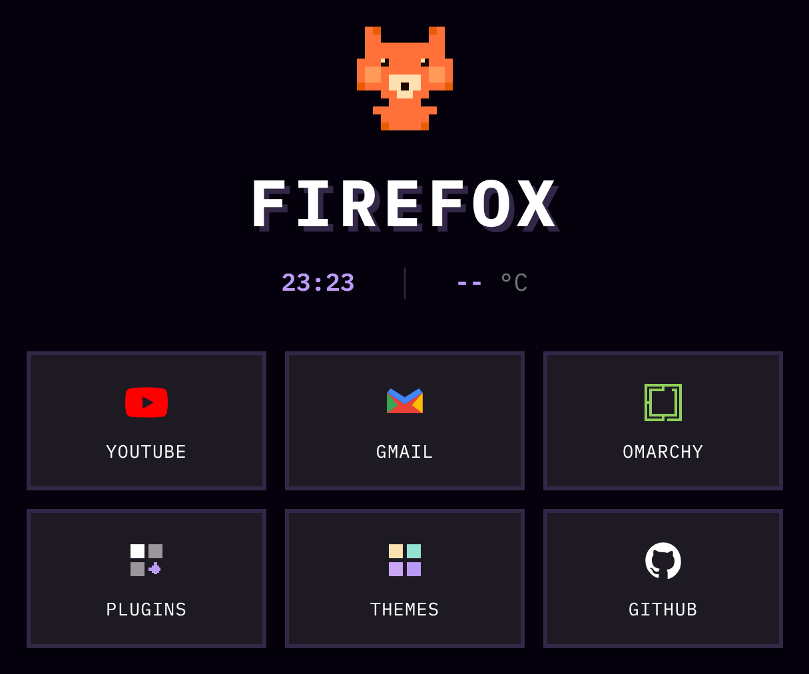
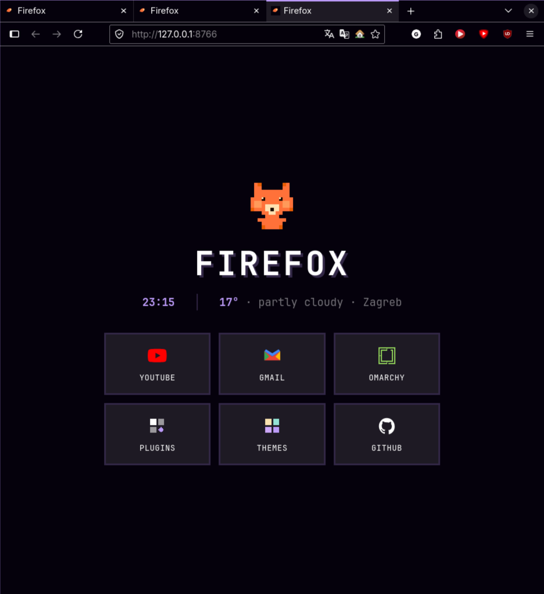
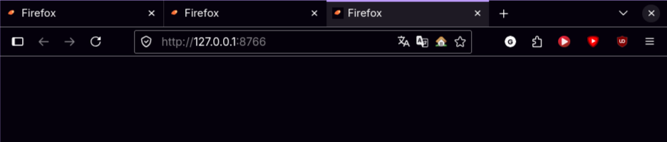
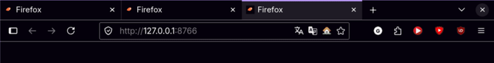

# Omarchy Firefox start page

A local Firefox **homepage / new-tab** page in the Omarchy style: pixel fox, live clock, weather, shortcut tiles, theme-aware colors, optional **Omafox** sync, and **rectangular (angular) Firefox tabs** via `userChrome.css`.

Runs entirely on your machine (`localhost:8765`). No accounts, no cloud.



<p align="center">
  
</p>

<p align="center"><em>Entrance animation (opacity + slide; no CSS blur)</em></p>

## What’s included

| Piece | What it does |
|-------|----------------|
| **Start page** (`index.html`) | Pixel fox, clock, Open-Meteo weather, 6 shortcut tiles |
| **Local server** (`serve.py`) | Serves the page on `:8765`, injects live palette, no FOUC |
| **systemd user unit** | Keeps the server running after login |
| **theme.json** | Fallback colors when Omafox isn’t present |
| **Omafox integration** | Optional live Omarchy theme sync + `theme-set.d` hook |
| **Angular tabs** | `userChrome.css` — square tabs, urlbar, toolbar buttons |

### Default shortcut tiles

YouTube · Gmail · Omarchy · Plugins · Themes · **GitHub**

(Weather city defaults to Zagreb; edit `WEATHER` in `index.html`.)

## Screenshots

### Start page in Firefox



### Rectangular tabs + chrome

Square tabs with a thin accent bar on the selected tab; urlbar and toolbar buttons match (no round pills).




<p align="center">
  
</p>

<p align="center"><em>Tab strip / chrome (managed `userChrome.css` block)</em></p>

## Quick install

```bash
git clone https://github.com/AbobaAI/omarchy-firefox-start.git
cd omarchy-firefox-start
./install.sh
```

Then in Firefox → **Settings → Home**:

- Homepage and new windows → Custom URLs → `http://127.0.0.1:8765/`
- New tabs → same URL

Restart Firefox once so `userChrome.css` (angular tabs) applies.

### Install options

```bash
./install.sh --with-omafox      # force-install Omafox via yay/paru if missing
./install.sh --without-omafox   # skip Omafox; use bundled theme.json
./install.sh --with-tabs        # install angular tabs (default)
./install.sh --without-tabs     # skip userChrome changes
```

On a TTY, if Omafox is missing, the script asks whether to install it.

### Optional pretty URL

```bash
echo -e '::1 firefox.localhost\n127.0.0.1 firefox.localhost' | sudo tee -a /etc/hosts
```

Then use `http://firefox.localhost:8765/`.

## Requirements

- Python 3 (stdlib only)
- `systemd --user` (Linux)
- Firefox (or any browser pointed at the URL)
- Optional: Arch/Omarchy + `yay`/`paru` for Omafox
- Optional: Omarchy `theme-set.d` hooks directory for live theme mirroring

## What `install.sh` changes on your system

1. Copies files to `~/.local/share/omarchy-firefox-start/`
2. Enables `omarchy-firefox-start.service` (user systemd) → `python3 serve.py` on port **8765**
3. **Omafox** (if present or newly installed):
   - runs `omafox setup` / `omafox sync` when available
   - seeds `theme.json` from `~/.local/state/omafox/theme.json`
4. Installs Omarchy hook:
   - `~/.config/omarchy/hooks/theme-set.d/omarchy-firefox-start`  
     (mirrors Omafox palette into the start-page fallback on theme change)
5. **Angular tabs** (unless `--without-tabs`):
   - merges `firefox/omarchy-tabs.userChrome.css` into each Firefox profile’s `chrome/userChrome.css` (managed block `BEGIN OMARCHY TABS` … `END OMARCHY TABS`)
   - sets `toolkit.legacyUserProfileCustomizations.stylesheets` = `true` in that profile’s `user.js`
   - searches profiles under `~/.mozilla/firefox`, `~/.config/mozilla/firefox`, and Flatpak Firefox

## Omafox (live Omarchy colors)

Optional. Without it the page still works using the bundled `theme.json`.

The server reads, in order:

1. `~/.local/state/omafox/theme.json`
2. `~/.local/share/omarchy-firefox-start/theme.json`

## Rectangular / angular tabs

Shipped CSS: [`firefox/omarchy-tabs.userChrome.css`](firefox/omarchy-tabs.userChrome.css)

- `--omarchy-tab-radius: 0px` on tabs, urlbar, toolbar buttons  
- Selected tab: `2px` inset accent bar (Hyprland-like)  
- Colors still come from the Firefox lightweight theme / Omafox  

Uninstall removes **only** the managed `OMARCHY TABS` block (other `userChrome.css` content is left alone).

## Customize

| What | Where |
|------|--------|
| Shortcut tiles | `index.html` — `<a class="tile">…</a>` |
| Weather city | `index.html` — `WEATHER = { latitude, longitude, timezone, label }` |
| Entrance animation | `index.html` — `@media (prefers-reduced-motion)` block |
| Fallback colors | `theme.json` |
| Tab geometry | `firefox/omarchy-tabs.userChrome.css` |

## Uninstall

```bash
./uninstall.sh
# optional:
# rm -rf ~/.local/share/omarchy-firefox-start
```

This stops the service, removes the theme-set hook, and strips the managed tabs CSS block. The Omafox package is **not** removed (`yay -Rns omafox` if you want that).

## Manual run (no systemd)

```bash
cd ~/.local/share/omarchy-firefox-start   # or this repo
python3 serve.py
```

## Changelog (high level)

- Public start page with GitHub tile (instead of region-specific streaming links)
- English UI strings + configurable `WEATHER` block
- `install.sh` / `uninstall.sh` + systemd user service
- Omafox detect / optional install + Omarchy `theme-set.d` hook
- Angular Firefox tabs via managed `userChrome.css`
- Docs screenshots + entrance / tabs GIFs

## License

MIT
